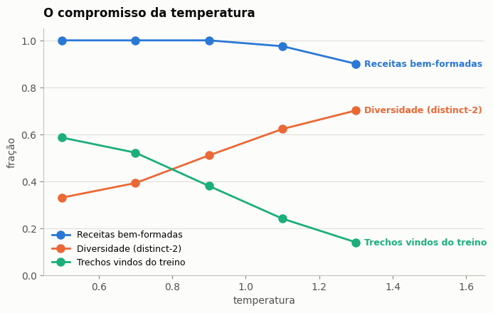
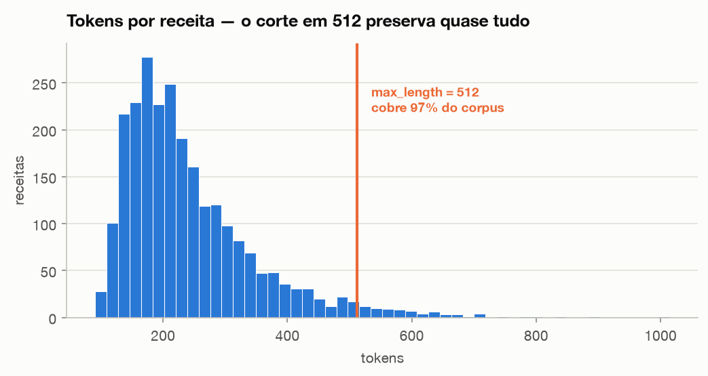
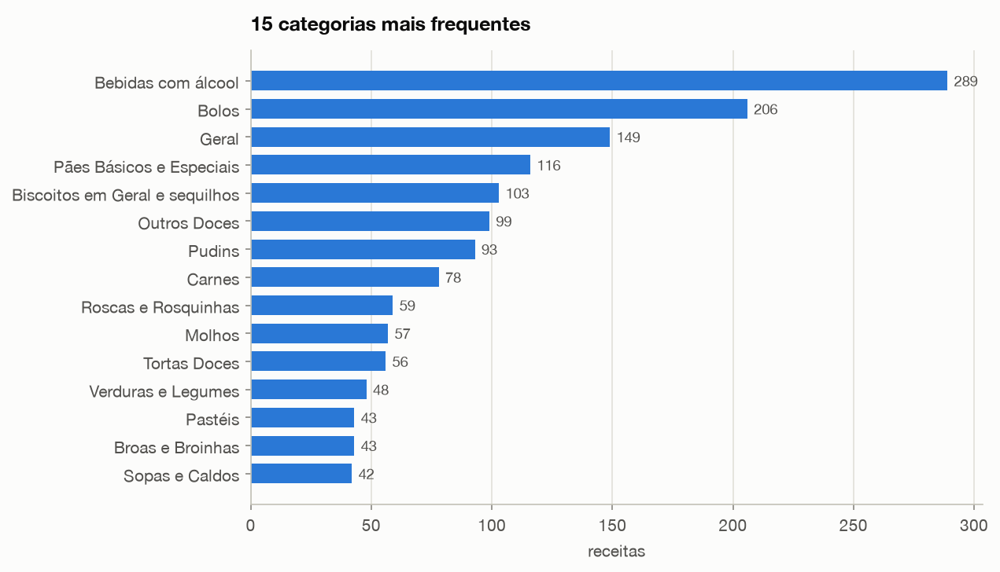

# 🍲 Cozinheiro Artificial

Modelo generativo de **receitas culinárias em português**, construído com
Hugging Face Transformers e entregue como um playground no Streamlit.

Tech Challenge — Fase 4 · Pós-graduação em Machine Learning Engineering

| Entrega | Link |
|---|---|
| Playground (Streamlit) | **[cozinheiro-artificial.streamlit.app](https://cozinheiro-artificial.streamlit.app/)** |
| Modelo (Hugging Face Hub) | [`denisevitoriano/receitas-gpt2-pt`](https://huggingface.co/denisevitoriano/receitas-gpt2-pt) |
| Vídeo de apresentação | _a preencher_ |

---

## O que é

Um GPT-2 small em português, ajustado em 2.506 receitas do Wikilivros, que
escreve receitas originais a partir de um título, de uma lista de ingredientes,
ou do nada.

O modelo base sabe português mas não sabe o que é uma receita. O fine-tuning
ensina duas coisas ao mesmo tempo: o **formato** (título, ingredientes, modo de
preparo) e o **vocabulário culinário** (medidas, utensílios, verbos de cozinha).

Três modos de uso:

| Modo | Você fornece | O modelo inventa |
|---|---|---|
| **Pelo título** | "Bolo de banana com canela" | ingredientes e preparo |
| **Pelos ingredientes** | o que tem na geladeira | o prato inteiro |
| **Surpreenda-me** | só a categoria | tudo, inclusive o nome |

> ⚠️ As receitas são geradas por um modelo estatístico e **não foram testadas na
> prática**. Quantidades, tempos e temperaturas podem estar errados. Uso
> recreativo.

---

## Decisões de projeto

### Por que GPT-2 small em vez de um modelo maior

A restrição que define tudo é o **deploy**: o Streamlit Community Cloud roda
apenas CPU, com poucos GB de RAM. Um modelo de 124M parâmetros gera uma receita
em segundos nessa máquina; qualquer coisa na casa dos bilhões simplesmente não
carrega. Escolher o modelo pelo ambiente de produção, e não pelo benchmark, é a
decisão mais importante do projeto.

Modelo base: [`pierreguillou/gpt2-small-portuguese`](https://huggingface.co/pierreguillou/gpt2-small-portuguese).

### Por que Wikilivros

Não existe dataset pronto de receitas em português no Hugging Face nem no
Kaggle. O [Livro de receitas](https://pt.wikibooks.org/wiki/Livro_de_receitas)
do Wikilivros resolve isso com três vantagens: é **português nativo** (não
tradução), tem **licença livre** (CC-BY-SA 3.0, sem a zona cinzenta jurídica de
raspar site de receita) e tem **estrutura regular**, o que dá um corpus limpo.

### Duas ordenações, uma receita

O playground precisa atender "tenho um título" e "tenho estes ingredientes".
São ordens diferentes dos mesmos campos, então cada receita entra no corpus
duas vezes, com uma tag `MODO:` indicando a ordem. Na geração, o prompt fixa o
modo e o modelo completa o resto.

### Split por página, não por receita

O Wikilivros usa `Nome do prato - 1`, `- 2` para variações da mesma preparação —
textos quase idênticos. Se uma variação caísse no treino e outra na validação, a
perplexidade ficaria artificialmente boa. O split agrupa por **página de
origem**, garantindo que variações fiquem sempre do mesmo lado.

### Tokens especiais para o modelo saber parar

`<|receita|>` e `<|fim|>` delimitam cada exemplo, e o `<|fim|>` vira o
`eos_token_id` da configuração de geração. Sem isso, o playground geraria texto
até bater no limite de tokens, no meio de uma frase.

O padding usa um token próprio (`<|pad|>`) em vez do `<|endoftext|>`: se
fossem o mesmo id, o *collator* mascararia também os fins de texto reais e o
modelo nunca aprenderia a encerrar.

### Por que o treino roda no Colab

Treinar exige manter pesos, gradientes e estados do otimizador na memória ao
mesmo tempo — cerca de 3 GB para um modelo de 124M. A máquina de
desenvolvimento (Mac M3, 8 GB) entrou em *swap* e cada passo passou de
frações de segundo para **79 segundos**. Na GPU T4 gratuita do Colab o treino
inteiro leva poucos minutos. A inferência, que é muito mais leve, roda bem em
CPU — inclusive no Streamlit Cloud.

---

## Avaliação

A prova pede para avaliar "qualidade e originalidade". Um número só não
responde isso, porque as propriedades desejadas competem entre si. O projeto
mede quatro eixos:

| Eixo | Pergunta | Métrica |
|---|---|---|
| **Qualidade** | Aprendeu a língua das receitas? | perplexidade na validação, base × ajustado |
| **Originalidade** | Está criando ou recitando de cor? | sobreposição de 5-gramas com o treino; maior trecho contíguo copiado |
| **Diversidade** | Gera coisas diferentes entre si? | distinct-2; Jaccard médio entre amostras |
| **Estrutura** | A saída é utilizável? | taxa de gerações bem-formadas |

Os parâmetros padrão do playground saem dessa medição, feita em
[`notebooks/03_avaliacao.ipynb`](notebooks/03_avaliacao.ipynb), e os controles
ficam expostos na barra lateral para quem quiser percorrer a fronteira.

### Resultados

| Métrica | Modelo base | Ajustado | Variação |
|---|---|---|---|
| Perplexidade (validação) | 37,10 | **5,14** | −86% |

Medida sobre os mesmos textos de validação, com os marcadores `<|receita|>` e
`<|fim|>` removidos — o modelo base nunca os viu, e cobrá-lo por prever um
token desconhecido mediria o vocabulário adicionado, não a língua.

Uma perplexidade de 5,14 é baixa, e vale ler o número com cuidado: parte do
ganho vem da **regularidade do formato**. Depois do ajuste, prever que a linha
seguinte a `INGREDIENTES:` começa com `- ` é quase gratuito. É justamente por
isso que a avaliação não para aqui — as métricas de originalidade e
diversidade existem para verificar se o modelo aprendeu a *compor* receitas ou
apenas a decorar o molde.

### O compromisso da temperatura

200 receitas geradas, 40 por temperatura, com os demais parâmetros fixos.



| Temperatura | Bem-formadas | Diversidade (distinct-2) | Trechos vindos do treino | Títulos repetidos |
|---|---|---|---|---|
| 0,5 | 100% | 0,33 | 59% | 30% |
| 0,7 | 100% | 0,39 | 52% | 5% |
| 0,9 | 100% | 0,51 | 38% | 5% |
| **1,1** | **97,5%** | **0,62** | **24%** | **0%** |
| 1,3 | 90% | 0,70 | 14% | 0% |

**O achado que mudou uma decisão do projeto.** A intuição diz que subir a
temperatura quebra a estrutura — mas não é o que acontece aqui: mesmo em 1,3,
90% das gerações continuam bem-formadas. Os tokens especiais e a regularidade
do formato seguram a estrutura mesmo com amostragem agressiva.

O compromisso real, então, não é *estrutura contra criatividade*, e sim
**cópia contra criatividade**. Isso torna o padrão inicial de 0,9 conservador
demais: ele pagava 38% de sobreposição com o treino sem necessidade.

**O padrão do playground passou de 0,9 para 1,1**, escolhido por eliminar os
títulos repetidos, cortar a cópia de 38% para 24% e aumentar a diversidade em
22%, ao custo de 2,5 pontos percentuais de gerações bem-formadas.

### Originalidade — o modelo copia?

| | |
|---|---|
| Maior trecho contíguo copiado do treino | 20 palavras (em temperatura 0,5) |
| Mediana entre todas as gerações | 10 palavras |
| Índice de comparação | 220.728 5-gramas distintos |

Nenhuma receita inteira foi reproduzida. O pior caso, de 20 palavras, apareceu
num pudim de leite condensado — uma preparação tão formulaica que a frase
"misture bem todos os ingredientes e leve ao fogo baixo" é praticamente a única
maneira de escrevê-la. É o tipo de sobreposição que se espera, não memorização.

### Limitação encontrada

As receitas geradas são **mais curtas que as reais**: cerca de 2,9 ingredientes
e 3,3 etapas, contra 6,6 e 5,5 do corpus. O modelo aprendeu o formato e encerra
cedo demais. Com um corpus maior, ou treinando mais épocas com controle de
originalidade, esse número provavelmente subiria.

---

## O corpus

2.506 receitas extraídas de 1.827 páginas do Wikilivros.





| | |
|---|---|
| Receitas | 2.506 |
| Páginas de origem | 1.827 |
| Categorias | 99 |
| Ingredientes (mediana) | 6 |
| Etapas de preparo (mediana) | 4 |
| Tokens no corpus | ~650 mil |

---

## Como rodar

Pré-requisito: [uv](https://docs.astral.sh/uv/).

```bash
git clone https://github.com/denisevitoriano/tech_challenge_fase_04.git
cd tech_challenge_fase_04
uv sync
```

### Reconstruir o corpus do zero

O corpus processado já vem versionado. Para regenerá-lo a partir do Wikilivros:

```bash
uv run python -m tech_challenge_fase_04.dados.coleta    # baixa 2.128 páginas
uv run python -m tech_challenge_fase_04.dados.preparo   # wikitext -> receitas
uv run python -m tech_challenge_fase_04.dados.corpus    # formato de treino + split
```

### Treinar

Na GPU do Colab (recomendado): abra
[`notebooks/02_treino_colab.ipynb`](notebooks/02_treino_colab.ipynb).

Localmente, se houver memória sobrando:

```bash
uv run python -m tech_challenge_fase_04.modelo.treino --epocas 3 --lr 5e-5
```

### Rodar o playground

```bash
uv run streamlit run app.py
```

Funciona sem nenhuma configuração: na ausência de um modelo treinado
localmente, o app baixa o modelo publicado no Hub. A ordem de precedência é
variável de ambiente → secret do Streamlit → diretório local de treino → Hub.

Para apontar para outro modelo sem editar código:

```bash
MODELO_HF=outro-usuario/outro-modelo uv run streamlit run app.py
```

---

## Estrutura

```
├── app.py                          # playground Streamlit
├── requirements.txt                # dependências do deploy (pip/Streamlit Cloud)
├── data/
│   ├── raw/                        # wikitext bruto (não versionado)
│   └── processed/                  # receitas estruturadas e corpus de treino
├── notebooks/
│   ├── 01_exploracao_corpus.ipynb  # EDA — o que há no corpus
│   ├── 02_treino_colab.ipynb       # fine-tuning na GPU + publicação no Hub
│   └── 03_avaliacao.ipynb          # as quatro métricas + varredura de temperatura
├── reports/
│   ├── figures/                    # gráficos exportados
│   ├── perplexidade.json           # base × ajustado
│   └── avaliacao_temperatura.csv   # a varredura completa
├── tests/                          # 63 testes do parser, do corpus e das métricas
└── src/tech_challenge_fase_04/
    ├── dados/
    │   ├── coleta.py               # API do Wikilivros -> wikitext bruto
    │   ├── preparo.py              # wikitext -> receitas estruturadas
    │   └── corpus.py               # formato de treino + split por página
    ├── modelo/
    │   ├── treino.py               # fine-tuning
    │   └── geracao.py              # geração e parsing da saída
    └── avaliacao/
        ├── metricas.py             # perplexidade, cópia, diversidade, estrutura
        └── visual.py               # paleta e estilo dos gráficos
```

### Testes

```bash
uv run pytest
```

Cobrem o parser de wikitext (incluindo os casos que quase estragaram o corpus),
a montagem do corpus com o split por página, o parsing da saída do modelo e as
métricas de avaliação. Nenhum exige baixar modelo, então rodam em segundos.

---

## Licenças

- **Código:** deste repositório.
- **Corpus:** [Livro de receitas](https://pt.wikibooks.org/wiki/Livro_de_receitas)
  do Wikilivros, CC-BY-SA 3.0. O modelo ajustado herda essa licença.
- **Modelo base:** `pierreguillou/gpt2-small-portuguese`.
